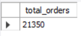
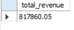
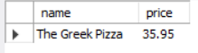
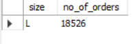
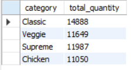
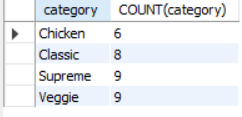
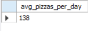
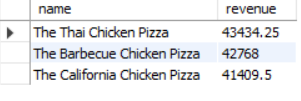
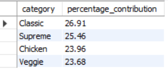

# 🍕 Pizza Sales Analysis

## 🔍 Project Overview
This project analyzes pizza sales data to uncover key business insights like top-selling pizzas, revenue patterns, category performance, and sales trends. The goal is to support business decisions with data-driven insights.

## 📁 Dataset
The dataset includes:
- `orders.csv` – Order-level data with date and time
- `order_details.csv` – Details of each pizza in an order
- `pizzas.csv` – Pizza sizes and prices
- `pizza_types.csv` – Types and categories of pizzas

## 🎯 Objectives
- Analyze revenue and quantity sold per pizza
- Find top-performing pizza categories
- Identify daily, weekly, and monthly sales trends
- Recommend actionable insights for business improvement

## 📊 Key Insights
- Highest revenue-generating pizzas and categories
- Customer preferences by size and type
- Time-based sales trends for better marketing

## 📂 Project Structure

pizza-sales-analysis/
│
├── data/ # All raw CSV files
├── output/ # Screenshots of outputs
├── README.md # Project overview and instructions

## 📸 Output Screenshots
## Below are some example outputs from the project:

### Retrieve the total number of orders placed.

### Calculate the total revenue generated from pizza sales.

### Identify the highest-priced pizza.

### Identify the most common pizza size ordered.

### List the top 5 most ordered pizza types along with their quantities.

### Join the necessary tables to find the total quantity of each pizza category ordered.

### Determine the distribution of orders by hour of the day.

### Join relevant tables to find the category-wise distribution of pizzas.

### Group the orders by date and calculate the average number of pizzas ordered per day.

### Determine the top 3 most ordered pizza types based on revenue.

### Calculate the percentage contribution of each pizza type to total revenue.

### Determine the top 3 most ordered pizza types based on revenue for each pizza category.

